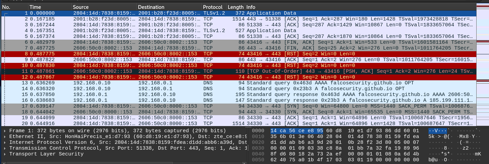
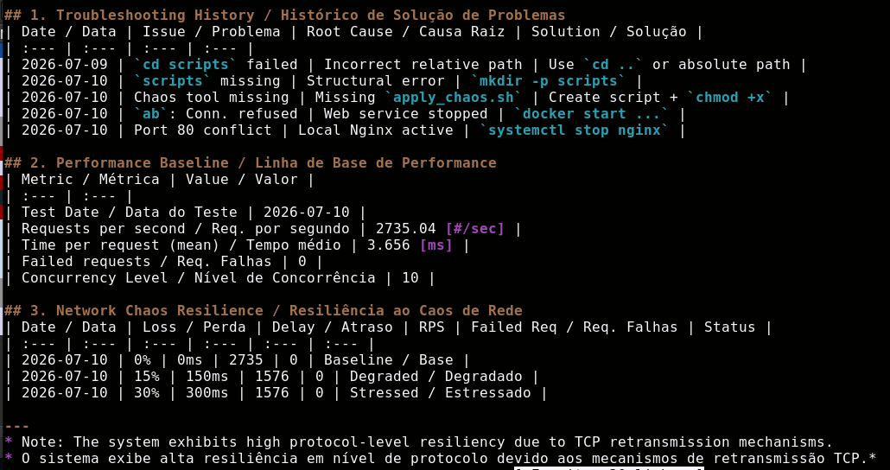
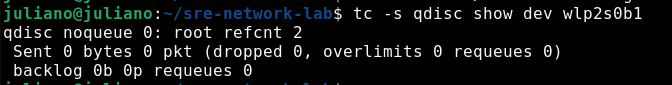

# SRE Network Lab

## Visão Geral / Project Overview
Este laboratório simula ambientes de produção com foco em **Chaos Engineering**, análise de tráfego TCP e resiliência de rede.
/ This lab simulates production environments, focusing on **Chaos Engineering**, TCP traffic analysis, and network resilience.

## Estrutura do Projeto / Project Structure
- `scripts/`: Scripts de automação e injeção de caos. / Automation and chaos injection scripts.
- `results/`: Logs de performance, capturas (.pcap) e relatórios de post-mortem. / Performance logs, PCAP traces, and post-mortem reports.

## Comandos de Operação / Operating Commands

### Template de Caos (`scripts/apply_chaos.sh`)
Utilize para injetar latência e perda de pacotes de forma controlada. / Use to inject latency and packet loss in a controlled manner.

```bash
#!/bin/bash
INTERFACE="wlp2s0b1"
TC="/usr/sbin/tc"

# Observabilidade: Registrar estado antes da alteração / Log state before change
echo "[$(date)] Estado anterior / State before: $($TC qdisc show dev $INTERFACE)"

# Limpeza e Aplicação / Cleanup and Apply
sudo $TC qdisc del dev $INTERFACE root 2>/dev/null
sudo $TC qdisc add dev $INTERFACE root netem loss 5% delay 50ms

# Verificação / Verification
echo "[$(date)] Novo estado / New state: $($TC qdisc show dev $INTERFACE)"

## Galeria de Evidências / Evidence Gallery
- **Execução do Laboratório:** 
- **Tabela de Performance:** 
- **Análise Wireshark:** 
